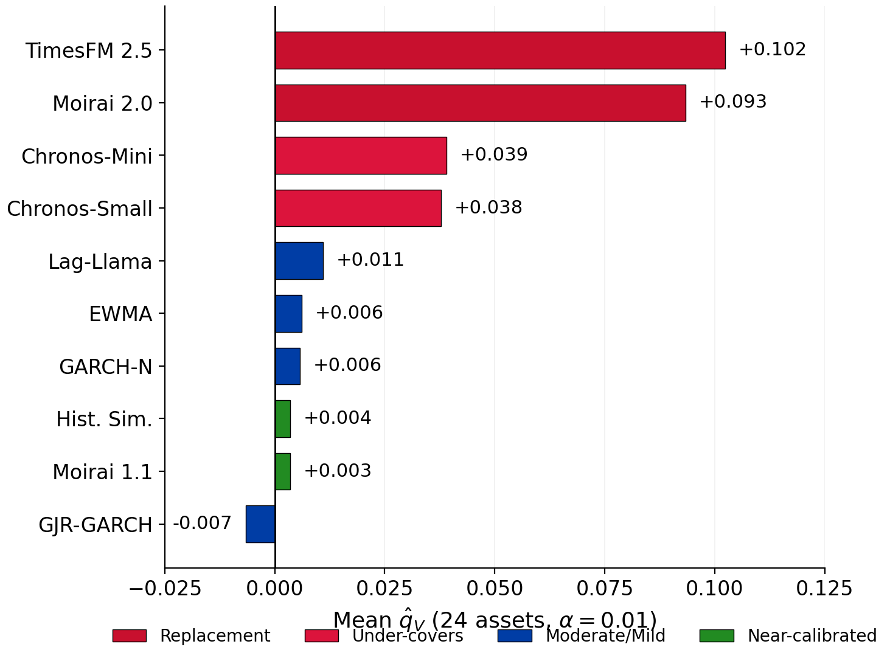

## CO_qV_ranking

Horizontal bar chart of mean conformal correction magnitude $\hat{q}_V$ across 10 forecasters (24 assets, $\alpha = 0.01$), color-coded by regime.

### Usage

```bash
python run_qV_ranking.py
```

### Input
- `cfp_ijf_data/paper_outputs/tables/all_results.csv`
- `cfp_ijf_data/paper_outputs/tables/moirai11_full_results.csv`

### Output
- `fig_qV_ranking.pdf` / `fig_qV_ranking.png`
